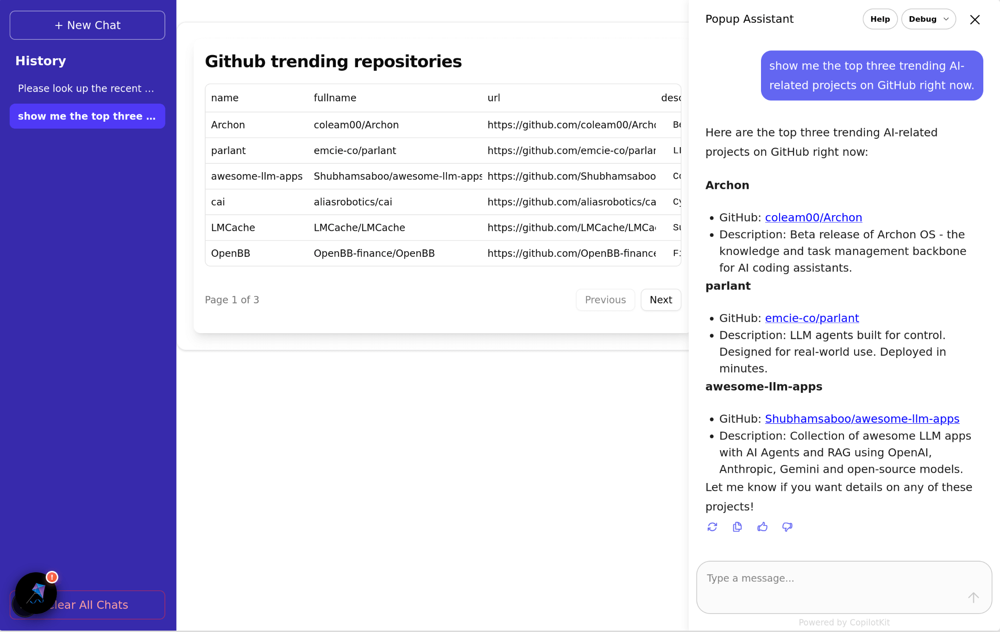
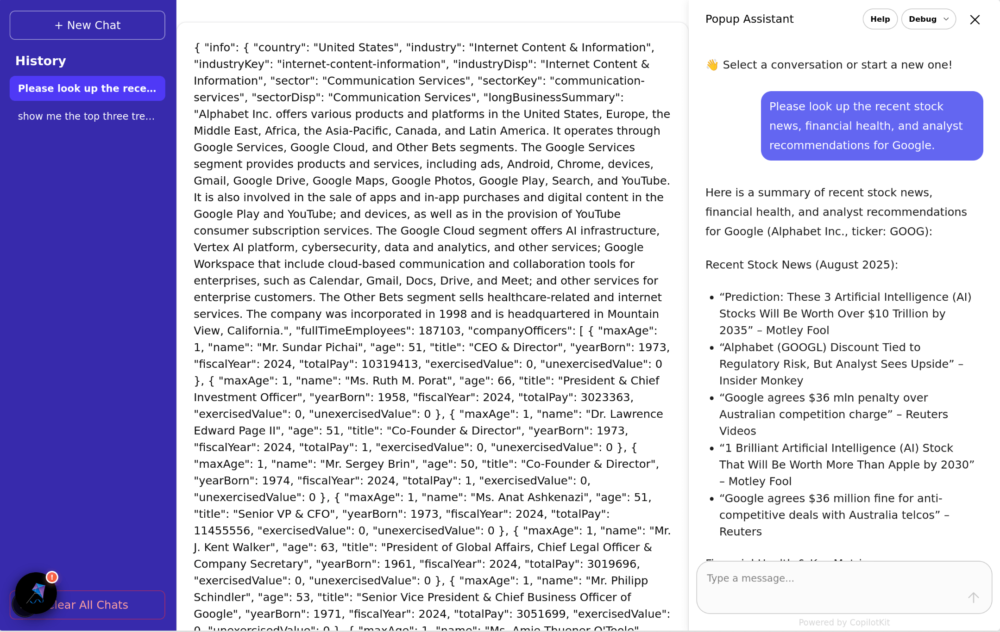
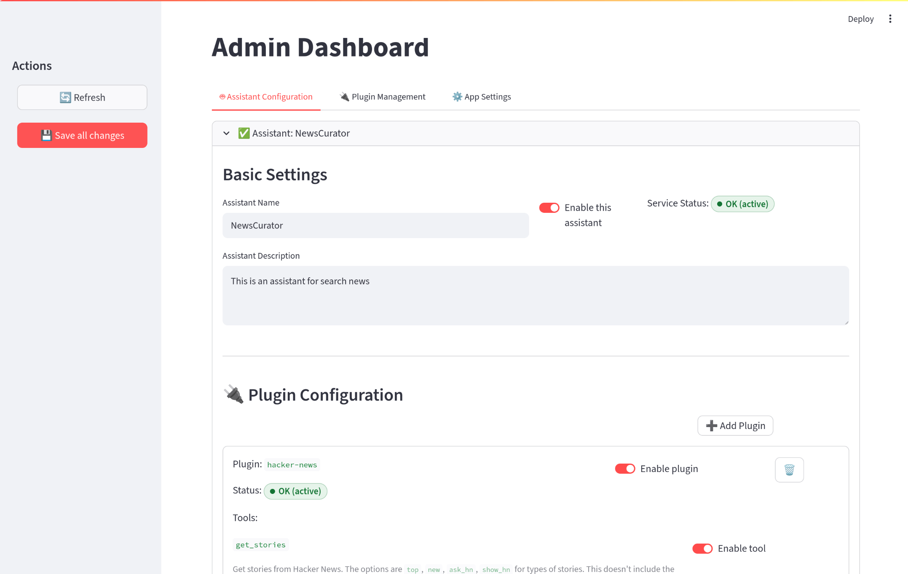
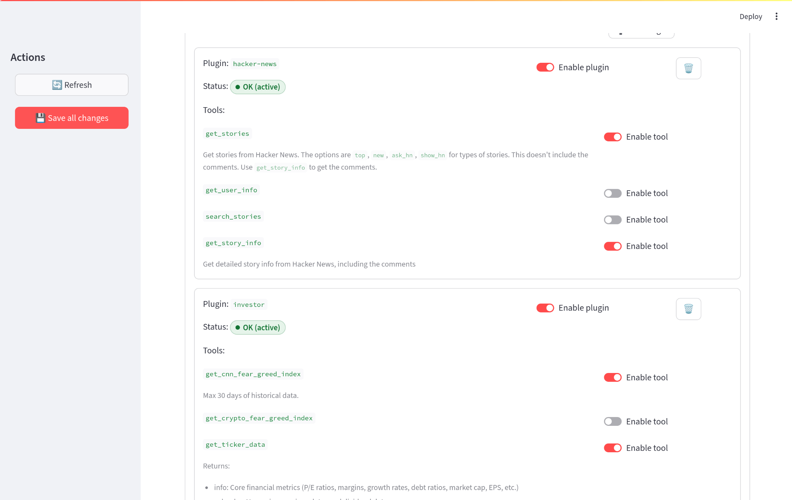
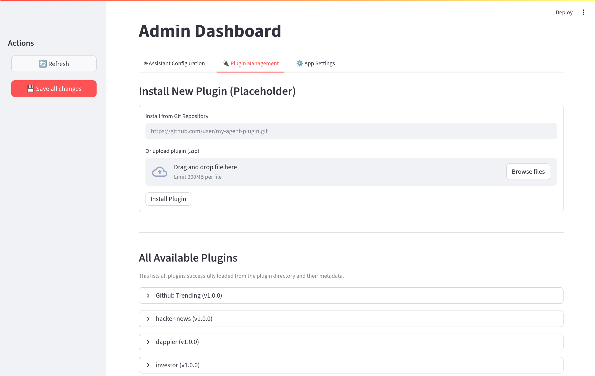
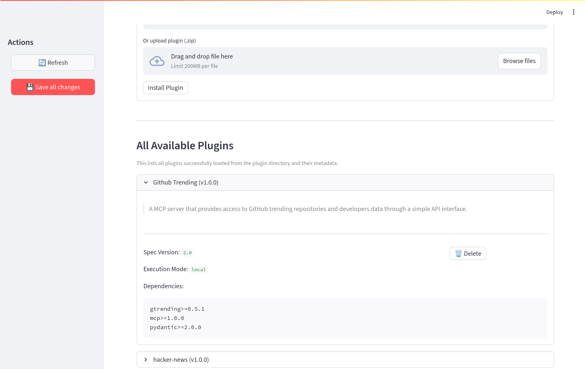

<div align="center"><a name="readme-top"></a>

# Dingent

**A lightweight, user-friendly LLM Agent framework focused on simplifying data retrieval application development.**

**English** · [简体中文](./README.zh-CN.md)

[Fast Track](https://saya-ashen.github.io/Dingent/docs/intro#fast-track)
|
[Installation](https://saya-ashen.github.io/Dingent/docs/getting-started/installation)
|
[Configuration](https://saya-ashen.github.io/Dingent/docs/getting-started/configuration)

</div>

**Dingent** is a lightweight, user-friendly agent framework whose core goal is to simplify the process of creating data-driven applications powered by Large Language Models (LLMs). We provide a concise yet powerful toolkit, with a standout feature of automatic database connectivity. This allows you to quickly link your database with an LLM to build applications capable of intelligent Q\&A, data extraction, and analysis. For other data sources like APIs and local documents, Dingent offers a flexible framework that developers can easily extend by writing custom code.
### Chat Interface
| Chat View 1 | Chat View 2 |
| :---: | :---: |
| [](./assets/Chat1.png) | [](./assets/Chat2.png) |

### Dashboard Overview
| Dashboard - View 1 | Dashboard - View 2 |
| :---: | :---: |
| [](./assets/Dashboard1.png) | [](./assets/Dashboard2.png) |
| **Dashboard - View 3** | **Dashboard - View 4** |
| [](./assets/Dashboard3.png) | [](./assets/Dashboard4.png) |

## 🎯 Why Choose Dingent?

When building LLM data applications, developers often spend a significant amount of time on "glue code": connecting to databases, wrapping APIs, setting up frontend-backend communication... These tasks are tedious and repetitive.

**Dingent's core value lies in:**

- **No More Repetition**: We package the best practices for backend services (LangGraph), data interfaces (**Plugin System**), and frontend presentation (CopilotKit) into a single command. You no longer need to build everything from scratch and can start writing your core business logic immediately.   
* **Core Features Built-In**: We believe a simple and easy-to-use agent shouldn't require users to spend a lot of time maintaining plugins. Therefore, we are committed to integrating features the community deems important directly into the framework. If you think a feature is crucial, we encourage you to open an Issue or PR. This directly reflects our core mission of "making Agents simpler for users."

* **Focused, Not Comprehensive**: Unlike other general-purpose Agent frameworks, Dingent specializes in data retrieval and Q\&A scenarios, offering a more lightweight and focused solution.

- **Smooth Learning Curve**: You only need a basic understanding of Python and some frontend knowledge to build powerful applications, without needing to be an expert in LangGraph or FastAPI. At the same time, we retain the flexibility to expand functionalities, ensuring the framework can fully support custom development when needed.

## ✨ Features

* **One-Click Project Initialization**: Use the `uvx dingent init` command to quickly generate a complete project structure with a frontend, backend, and core logic using templates.
* **Admin Dashboard**: A web-based configuration management interface built with Streamlit for easy setup and management of assistants, plugins, and settings.
* **Lightweight and Easy to Use**: A clean design and a gentle learning curve let you focus on business logic rather than tedious configuration.
* **Specialized for Data Retrieval**: Optimized for scenarios like data Q\&A, extraction, and analysis to provide efficient solutions.
* **Flexible Data Source Integration**: Easily integrate with various data sources, including APIs, databases, and files (PDF, Markdown, etc.).
* **LLM-Powered**: Seamlessly connect with mainstream LLMs like the OpenAI GPT series, local models, and more.

## 🚀 Quick Start

Create a fully functional agent project from scratch in just a few minutes.

### 1. Prerequisites

Before you begin, ensure your development environment has the following installed:

* [**uv**](https://docs.astral.sh/uv/getting-started/installation/): A very fast Python package installer and resolver.

```bash
# On macOS and Linux
curl -LsSf https://astral.sh/uv/install.sh | sh

# On Windows
powershell -ExecutionPolicy ByPass -c "irm https://astral.sh/uv/install.ps1 | iex"
```

* [**Node.js**](https://nodejs.org/en/download/) version 18.0 or above (which can be checked by running node -v)

    Installation: [https://nodejs.org/en/download](https://nodejs.org/en/download)

* [**bun**](https://bun.com/): A node package manager that is used to install the frontend dependencies.

```bash
# On macOS and Linux
curl -fsSL https://bun.sh/install | bash

# On window
powershell -c "irm bun.sh/install.ps1 | iex"
```

### 2. Initialize Your Agent Project

Run the following command, and the Dingent CLI will guide you through the project creation process.

```bash
# Use the 'basic' template to create a new project
uvx dingent init basic
```

The CLI will prompt you for a project name, author, etc., and then automatically create the project directory and install all frontend and backend dependencies.

### 3. Launch and Develop

Once the project is created, navigate to the project directory:

```bash
cd my-awesome-agent

# On macOS and Linux
export OPENAI_API_KEY=sk-xxxxxxxxxxxxxxxxxxx # Replace with your OpenAI API Key

# On Windows (PowerShell)
$env:OPENAI_API_KEY="sk-xxxxxxxxxxxxxxxxxxx" # Replace with your OpenAI API Key

uvx dingent run
```

By default, Dingent will start three services: the backend service (automatically loading any available plugins), the frontend interface, and an admin dashboard for configuration management. The frontend will open automatically in your browser at [http://localhost:3000](http://localhost:3000), and the admin dashboard will be available at [http://localhost:8501](http://localhost:8501).

Your project skeleton is now ready\! You can now:

  * **Configure your assistant**: Use the admin dashboard at `http://localhost:8501` to manage plugins, assistants, and LLM settings.
  * **Explore the project structure**: See the `🏛️ Project Architecture` section below to understand the directory layout.
  * **Develop the backend logic**: Edit the Python files in the `backend/` directory to implement your core agent logic. Custom tools and integrations should be placed in the `backend/plugins/` directory. 
  * **Develop the frontend interface**: Build your user interface in the `frontend/` directory.

## 🏛️ Project Architecture

Projects generated with the `init` command have a standardized structure, making collaboration and maintenance easier:

```plaintext
my-awesome-agent/
├── 📁 backend/       # Backend service (based on FastAPI and LangGraph)
├── 📁 frontend/      # Frontend application (based on CopilotKit)
└── 📄 README.md      # The project's documentation
```

Dingent automatically provides an admin dashboard for configuration management, accessible at `http://localhost:8501` when you run your project.

### 📦 backend/

* The backend service is the core coordinator of the application, built with FastAPI and [LangGraph](https://www.langchain.com/langgraph).
* **Primary Responsibilities**: It handles requests from the frontend, orchestrates the Agent's core logic, interacts with the LLM, and manages all plugins.
* **`plugins/` subdirectory**: This is where you place your custom tools. Any standard FastMCP service can be dropped in here (with a `plugin.toml` file) to be automatically discovered and loaded by Dingent.
* **Files**: `main.py` is the service entry point where you can define API routes and the Agent's execution flow. For details, refer to the [LangGraph documentation](https://langchain-ai.github.io/langgraph).

### 📦 frontend/

* The frontend is a modern web interface built with [CopilotKit](https://docs.copilotkit.ai), responsible for all user interaction.
* **Primary Responsibilities**: It provides an interface for users to ask questions and displays the Agent's streaming responses, data tables, Markdown, and other content formats.
* **Files**: The core page logic is in `src/app/page.tsx`, and UI components are in `src/components/`.

## 🗺️ Roadmap

  - **✅ 1. Documentation & Tutorials**
    - `[x]` **Basic Docs:** Installation and configuration guides.
    - `[ ]` **Core Concepts:** In-depth explanations of key features and design.
    - `[ ]` **Plugin Dev Guide:** How to build your own plugins.
    - `[ ]` **End-to-End Tutorials:** Complete, step-by-step project examples.

  - **⏳ 2. Plugin System**
    - `[x]` **Plugin management system**: Automatically loads plugin configurations and manages dependencies.
    - `[ ]` **Plugin CLI:** Install and manage plugins via the command line.
    - `[ ]` **Plugin Marketplace:** Discover, search, and download community plugins.
    - `[x]` **Plugin Manager GUI:** A graphical interface to easily manage your plugins.

  - **💡 3. Core Plugins**
    - `[x]` **Database Plugin:** Connect to mainstream databases.
    - `[ ]` **Knowledge Base Q\&A Plugin:** Quickly build a Q\&A application on your documents.

## 🤝 How to Contribute

We created this project to make Agents simpler for users, not to build yet another complex development framework. Therefore, we warmly welcome and heavily rely on community contributions to shape the future of **Dingent**.

If a feature is important to you, we strongly encourage you to discuss it by opening a GitHub Issue or contributing code directly through a Pull Request. Our core philosophy is that the developer community should decide which features are built into the software, rather than leaving users to maintain their own plugins\!

If you share our vision and wish to contribute code, please follow these steps:

1. Fork this repository.
2. Create a new feature branch (`git checkout -b feature/YourAmazingFeature`).
3. Commit your changes (`git commit -m 'Add some AmazingFeature'`).
4. Push your branch to GitHub (`git push origin feature/YourAmazingFeature`).
5. Create a Pull Request and clearly describe the value of your feature.

We believe that through our collective efforts, Dingent can become a truly powerful and "out-of-the-box" tool.

## 🙏 Acknowledgements

This project incorporates code from the following open-source projects. We are grateful to their developers for their contributions to the community:

  * **[arxiv-mcp-server](https://github.com/prashalruchiranga/arxiv-mcp-server)**: Licensed under the MIT License.

## 📄 License

This project is licensed under the [MIT License](./LICENSE).
