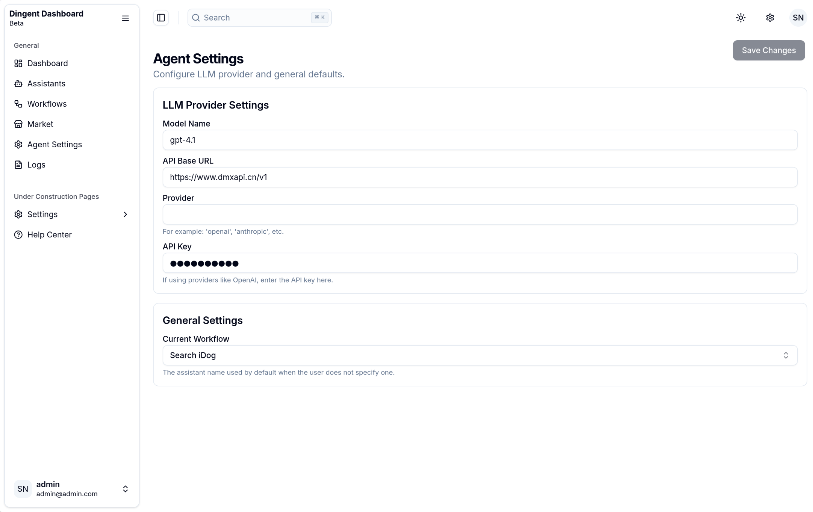
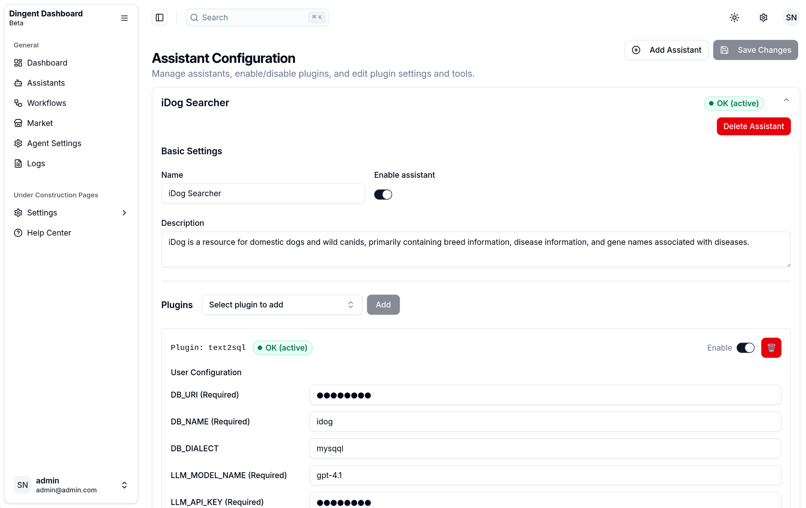
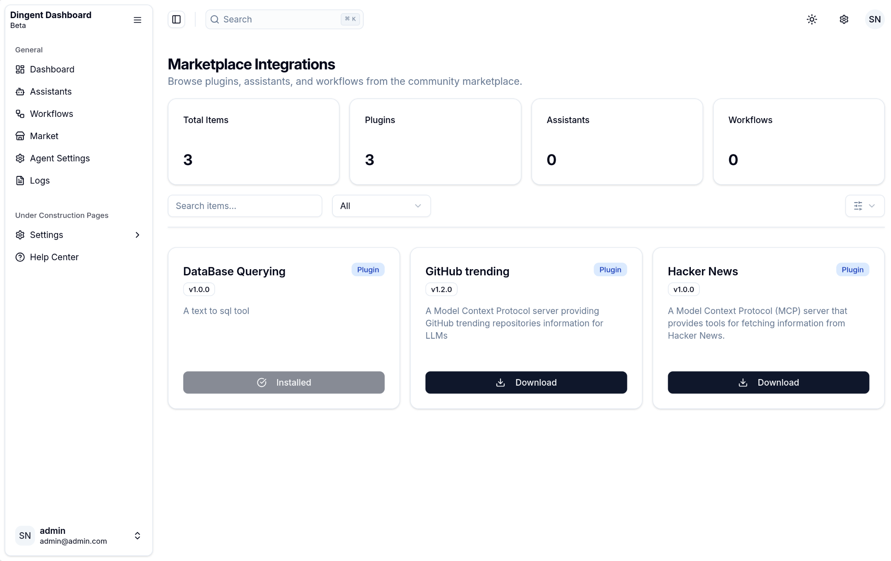

<div align="center"><a name="readme-top"></a>

# Dingent

**A powerful, yet user-friendly LLM Agent framework designed to streamline the entire development lifecycle of intelligent applications.**

**English** · [简体中文](./README.zh-CN.md)

[Quick Start](https://saya-ashen.github.io/Dingent/docs/intro%23quick-start)
|
[Installation](https://saya-ashen.github.io/Dingent/docs/getting-started/installation)
|
[Configuration](https://saya-ashen.github.io/Dingent/docs/getting-started/configuration)

</div>

**Dingent** is an agent framework whose core goal is to simplify the process of creating any application powered by Large Language Models (LLMs). We provide a concise yet powerful toolkit... to build applications capable of automating complex workflows, interacting with various services, and performing intelligent analysis. For any custom logic or integration, Dingent offers a flexible framework that developers can easily extend by writing custom code.

### Chat Interface

| Chat View 1 | Chat View 2 |
| :---: | :---: |
|  |  |

### Admin Dashboard

| Dashboard - Overview | Dashboard - Workflows |
| :---: | :---: |
|  |  |
| **Dashboard - Settings** | **Dashboard - Logs** |
|  |  |
| **Dashboard - Assistants** | **Dashboard - Market** |
|  |  |

## 🎯 Why Choose Dingent?

When building LLM applications, developers often spend a significant amount of time on "glue code": creating backend services, wrapping APIs, setting up frontend-backend communication... These tasks are tedious and repetitive.

**Dingent's core value lies in:**

  - **No More Repetition**: We package the best practices for backend services (LangGraph), data interfaces (**Plugin System**), a chat interface (CopilotKit), and a **full-featured admin dashboard** into a single command. You no longer need to build everything from scratch and can start writing your core business logic immediately.
  * **Configuration via UI**: Forget manually editing complex configuration files. With Dingent's integrated admin dashboard, you can manage assistants, build workflows, and configure settings through an intuitive graphical interface.
  * **Extensible and Versatile**: While Dingent began with a focus on data retrieval, it has evolved into a powerful general-purpose framework. Its modular architecture and robust plugin system allow you to build any type of agent—from simple task automation bots to complex multi-agent systems. Dingent provides the solid foundation, you bring the vision.
  * **Core Features Built-In**: We believe a simple and easy-to-use agent shouldn't require users to spend a lot of time maintaining plugins. Therefore, we are committed to integrating features the community deems important directly into the framework. If you think a feature is crucial, we encourage you to open an Issue or PR. This directly reflects our core mission of "making Agents simpler for users."
  - **Smooth Learning Curve**: You only need a basic understanding of Python to build powerful, general-purpose agents, without needing to be an expert in LangGraph or FastAPI. At the same time, we retain the flexibility to expand functionalities, ensuring the framework can fully support custom development when needed.

## ✨ Features

  * **Instant Project Setup**: Simply run `dingent dev` in any directory to initialize a new project.
  * **Integrated Admin Dashboard**: A powerful, React-based web interface to visually manage your assistants, workflows, plugins, and settings.
  * **Bundled Frontend**: A pre-built, standalone Next.js chat interface is included out-of-the-box. No need for manual setup or compilation.
  * **Lightweight and Easy to Use**: A clean design and a gentle learning curve let you focus on business logic rather than tedious configuration.

## 🚀 Quick Start

Create and run a fully functional agent project in just a few minutes.

### 1. Prerequisites

Before you begin, ensure your development environment has the following installed:

  * [**uv**](https://docs.astral.sh/uv/getting-started/installation/): A very fast Python package installer and resolver.

<!-- end list -->

```bash
# On macOS and Linux
curl -LsSf https://astral.sh/uv/install.sh | sh

# On Windows
powershell -ExecutionPolicy ByPass -c "irm https://astral.sh/uv/install.ps1 | iex"
```

### 2. Initialize and Run Your Project

Navigate to an empty directory where you want to create your project and run the development server.

```bash
mkdir my-awesome-agent
cd my-awesome-agent

# Run the development server
uvx dingent dev # or uvx dingent run
```

The first time you run this command, Dingent will ask if you want to create a `dingent.toml` configuration file, officially turning the directory into a Dingent project root.

The `dev` command will start all necessary services:

  * **Frontend Chat**: Accessible at [http://localhost:3000](http://localhost:3000)
  * **Backend API**: Running at [http://localhost:8000](http://localhost:8000)
  * **Admin Dashboard**: Accessible at [http://localhost:8000/admin](http://localhost:8000/admin)

Your project is now live\! You can now:

  * **Configure your application**: Open the admin dashboard at `http://localhost:8000/admin` to create assistants, build workflows, and configure your LLM settings.
  * **Add custom tools**: Place your custom MCP server plugins into the `plugins/` directory.
  * **Interact with your agent**: Start chatting with your agent through the frontend at `http://localhost:3000`.

## 🏛️ Project Architecture

A Dingent project has a simple and intuitive structure, managed automatically for you:

```plaintext
my-awesome-agent/
├── 📄 dingent.toml     # Main project config (ports, model, etc.). Marks the project root.
├── 📁 config/          # Stores all application configurations managed by the dashboard.
│   ├── 📁 assistants/
│   ├── 📁 plugins/
│   └── 📁 workflows/
└── 📁 plugins/         # Directory for your custom tool plugins (e.g., MCP servers).
```

  * **`dingent.toml`**: The single source of truth for your project's core settings. The presence of this file tells Dingent commands that they are in a project directory.
  * **`config/`**: This directory holds the configuration for your assistants, plugins, and workflows. You typically won't need to edit these files manually, as they are managed through the **Admin Dashboard**.
  * **`plugins/`**: This is where you add your own functionality. Place any MCP-compatible server in this directory, and Dingent will automatically discover and integrate it.

## 🗺️ Roadmap

  - **✅ 1. Documentation & Tutorials**

      - [x] **Basic Docs:** Installation and configuration guides.
      - [ ] **Core Concepts:** In-depth explanations of key features and design.
      - [ ] **Plugin Dev Guide:** How to build your own plugins.
      - [ ] **End-to-End Tutorials:** Complete, step-by-step project examples.

  - **⏳ 2. Admin Dashboard**

      - [x] **Core UI**: Fully functional dashboard for managing assistants, workflows, and settings.
      - [x] **Plugin Management**: Add/remove plugins directly from the UI.
      - [x] **Advanced Workflow Editor**: More powerful tools for building complex agent behaviors.

  - **💡 3. Plugin System**

      - [x] **Auto-Discovery**: Automatically loads plugins from the `plugins/` directory.
      - [ ] ~~**Plugin CLI:** Install and manage plugins via the command line.~~
       (Superseded by UI management in the Admin Dashboard)
      - [x] **Plugin Marketplace:** Discover, search, and download community plugins.

  - **📦 4. Core Plugins**

      - [x] **Database Plugin:** Connect to mainstream databases.
      - [ ] **Knowledge Base Q\&A Plugin:** Quickly build a Q\&A application on your documents.

## 🤝 How to Contribute

We created this project to make Agents simpler for users, not to build yet another complex development framework. Therefore, we warmly welcome and heavily rely on community contributions to shape the future of **Dingent**.

If a feature is important to you, we strongly encourage you to discuss it by opening a GitHub Issue or contributing code directly through a Pull Request. Our core philosophy is that the developer community should decide which features are built into the software, rather than leaving users to maintain their own plugins\!

If you share our vision and wish to contribute code, please follow these steps:

1.  Fork this repository.
2.  Create a new feature branch (`git checkout -b feature/YourAmazingFeature`).
3.  Commit your changes (`git commit -m 'Add some AmazingFeature'`).
4.  Push your branch to GitHub (`git push origin feature/YourAmazingFeature`).
5.  Create a Pull Request and clearly describe the value of your feature.

We believe that through our collective efforts, Dingent can become a truly powerful and "out-of-the-box" tool.

## 📄 License

This project is licensed under the [MIT License](./LICENSE).
