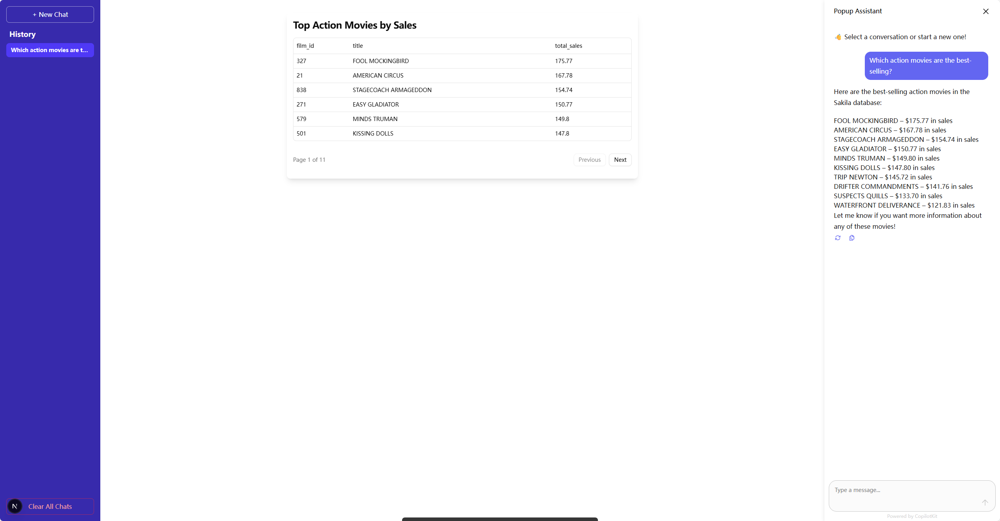

<div align="center"><a name="readme-top"></a>

# Dingent

  <strong>一个轻量级、用户友好的 LLM 智能体（Agent）框架，专注于简化数据检索应用开发。</strong>


[English](./README.md) · **简体中文**

[快速开始](https://saya-ashen.github.io/Dingent/docs/intro#fast-track)
|
[安装说明](https://saya-ashen.github.io/Dingent/docs/getting-started/installation)
|
[配置说明](https://saya-ashen.github.io/Dingent/docs/getting-started/configuration)


</div>


**Dingent** 是一个轻量级、用户友友好的智能体（Agent）框架，其核心目标是简化基于大型语言模型（LLM）的数据应用的创建过程。我们提供了一个简洁而强大的工具包，核心亮点是能够自动连接数据库，使您能够快速地将数据库与 LLM 连接，从而构建能够进行智能问答、数据提取和分析的应用程序。对于API、本地文档等其他数据源，Dingent 提供了灵活的框架，开发者可以通过编写自定义代码轻松接入。



## 🎯 为什么选择 Dingent?
在构建 LLM 数据应用时，开发者常常需要花费大量时间在“胶水代码”上：连接数据库、封装 API、搭建前后端通信... 这些工作繁琐且重复。

**Dingent** 的核心价值在于：

* **拒绝重复**: 我们将后端服务 (LangGraph)、数据接口 (Assistants) 和前端展示 (CopilotKit) 的最佳实践打包成一个命令。你无需再手动搭建，可以立即开始编写核心业务逻辑。

* **内置核心功能**: 我们认为，一个简单易用的智能体，不应该让用户花费大量时间维护插件。因此，我们致力于将社区认为重要的功能直接内置到框架中。如果你认为某个功能很重要，我们鼓励你提出 Issue 或 PR，这直接体现了我们“让用户更简单地使用 Agent”的核心使命。

* **专注而非全面**: 与其他通用型 Agent 框架不同，Dingent 专注于数据检索与问答场景，提供了更轻量、更聚焦的解决方案。

* **平滑的学习曲线**: 你只需要了解 Python 和一些基本的前端知识，无需成为 LangGraph 或 FastAPI 的专家就能构建出强大的应用。同时，我们也保留了快速拓展功能的灵活性，保证用户在需要时，该框架能完全胜任个性化功能的开发。

## ✨ 功能特性

* **一键项目初始化**: 使用 `uvx dingent init` 命令，通过模板快速生成包含前后端和核心逻辑的完整项目结构。
* **轻量易用**: 设计简洁，学习曲线平缓，让您专注于业务逻辑而非繁琐的配置。
* **专注数据检索**: 为数据问答、提取和分析等场景特别优化，提供高效的解决方案。
* **灵活的数据源接口**: 轻松集成 API、数据库、文件（PDF, Markdown, ...）等多种数据源。
* **LLM 驱动**: 支持与主流的 LLM（如 OpenAI GPT 系列、本地模型等）无缝对接。


## 🚀 快速开始

在几分钟内，从零开始创建一个功能完备的智能体项目。

### 1. 环境准备

在开始之前，请确保您的开发环境中已安装以下工具：

* [**uv**](https://docs.astral.sh/uv/getting-started/installation/): 一个非常快的 Python 包安装和管理工具。
```bash
# On macOS and Linux.
curl -LsSf https://astral.sh/uv/install.sh | sh
```

```bash
# On Windows.
powershell -ExecutionPolicy ByPass -c "irm https://astral.sh/uv/install.ps1 | iex"
```

- [**Node.js**](https://nodejs.org/en/download/) 版本>18.0  (运行node -v 查看)
安装说明: [https://nodejs.org/en/download](https://nodejs.org/en/download)

* [**bun**](https://bun.com/): 一个快速的 Node 包管理器，用于安装前端依赖。

```bash
# On macOS and Linux
curl -fsSL https://bun.sh/install | bash

# On window
powershell -c "irm bun.sh/install.ps1 | iex"
```

### 2. 初始化您的智能体项目

执行以下命令，Dingent CLI 将引导您完成项目的创建。

```bash
uvx dingent[cli] init basic # 使用basic模板创建一个基础项目
```

CLI 会提示您输入项目名称、作者等信息，然后自动创建项目目录、安装所有前后端依赖。

### 3. 启动并开发

项目创建成功后，进入项目目录：
```bash
cd my-awesome-agent
# On macOS and Linux
export OPENAI_API_KEY=sk-xxxxxxxxxxxxxxxxxxx # 替换为你的 OpenAI API Key
# On windows
$env:OPENAI_API_KEY="sk-xxxxxxxxxxxxxxxxxxx" # 替换为你的 OpenAI API Key
uvx dingent run
```
默认情况下，Dingent 会启动一个Langgraph后端服务和多个Assistants服务，并在浏览器中打开前端界面。
如果前端没有自动打开，您可以手动访问 [http://localhost:3000](http://localhost:3000) 来查看。

现在，您的项目骨架已经准备就绪！您可以：

  * **探索项目结构**: 查看下面 `🏛️ 项目架构` 部分以了解目录结构。
  * **开发后端逻辑**: 编辑 `assistants/` 和 `backend/` 目录下的 Python 文件，实现您的核心智能体逻辑和 API。
  * **开发前端界面**: 在 `frontend/` 目录下构建您的用户交互界面。

## 🏛️ 项目架构

通过 `init` 命令生成的项目具有标准化的结构，让协作和维护更加轻松：

```plaintext
my-awesome-agent/
├── 📁 backend/         # 后端服务 (基于 FastAPI 和 LangGraph)
├── 📁 frontend/        # 前端应用 (基于 CopilotKit)
├── 📁 assistants/      # 面向特定领域任务的工具集合
└── 📄 README.md        # 项目的说明文档
```


### 📦 backend/

* 后端服务是整个应用的核心协调者，基于 FastAPI 和 [LangGraph](https://www.langchain.com/langgraph) 构建。

* 主要职责: 负责处理来自前端的请求，编排和执行 Agent 的核心逻辑，与 LLM 和 Assistants 服务进行交互，并向前端返回结果。

* 文件: main.py 是服务入口，你可以在此定义 API 路由和 Agent 的运行流程。具体可参考[LangGraph 文档](https://langchain-ai.github.io/langgraph)。]

### 📦 frontend/

* 前端应用是一个现代化的 Web 界面，基于[CopilotKit](https://docs.copilotkit.ai) 构建，负责所有用户交互。

* 主要职责: 提供用户输入问题的界面，展示 Agent 返回的流式响应、数据表格、Markdown 等多种格式的内容。

* 文件: 核心页面逻辑位于 src/app/page.tsx，UI 组件位于 src/components/。

### 📦 assistants/

* 在Dingent中，一个助手（Assistant）是一些工具的集合，这些工具往往具有相似的功能或数据源，在执行某项特定任务时可以被模型反复调用。

* 主要职责: 将数据和功能暴露给 backend 中的 Agent。

* 文件:

    * data/: 存放你的数据源文件（如 .db, .csv, .md）。

    * plugins/: 定义你可以被 Agent 调用的自定义工具。这里是实现您个性化或私有业务逻辑的理想之地。但请注意，如果您开发的工具具有普适性，我们强烈建议您通过 Pull Request 将其贡献给主项目，以帮助所有用户！

    * main.py: 启动 Assistants 服务并注册上述资源和工具。

## 🗺️  路线图
- **✅ 1. 完善文档和教程**
    - `[x]` **基础文档:** 安装和配置指南。
    - `[ ]` **核心概念:** 深入解释关键功能和设计。
    - `[ ]` **插件开发指南:** 如何构建你自己的插件。
    - `[ ]` **完整教程:** 提供从零到一的项目示例。

- **⏳ 2. 插件系统**
    - `[x]` **插件管理系统:** 自动加载插件配置和管理依赖。
    - `[ ]` **插件命令行工具:** 通过命令行安装和管理插件。
    - `[ ]` **插件市场:** 发现、搜索和下载社区插件。
    - `[ ]` **图形化管理界面:** 在图形界面中轻松管理插件。

- **💡 3. 核心插件**
    - `[x]` **数据库集成插件:** 连接到主流的数据库。
    - `[ ]` **知识库问答插件:** 快速搭建知识库问答应用。

## 🤝 如何贡献

我们建立该项目的初衷是为了让用户更简单地使用 Agent，而不是创建又一个复杂的开发框架。因此，我们热烈欢迎并高度依赖社区的贡献来决定 **Dingent** 的未来方向。

如果你认为某个功能对你很重要，我们强烈建议你通过 GitHub Issues 提出讨论，或直接通过 Pull Request 贡献代码。我们的核心理念是：由开发者社区决定哪些功能应该被内置到软件中，而不是让用户自己维护一个插件!

如果您认同我们的理念并希望贡献代码，请遵循以下步骤：

1. Fork 本项目。

2. 创建一个新的功能分支 (git checkout -b feature/YourAmazingFeature)。

3. 提交您的代码更改 (git commit -m 'Add some AmazingFeature')。

4. 将您的分支推送到 GitHub (git push origin feature/YourAmazingFeature)。

4. 创建一个 Pull Request，并在描述中清晰地说明该功能的价值。

我们相信，通过社区的共同努力，Dingent 可以成为一个真正“开箱即用”且功能强大的工具。

## 📄 许可证

本项目采用 [MIT License](./LICENSE) 授权。
