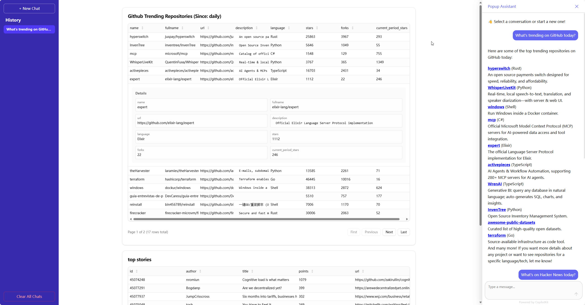
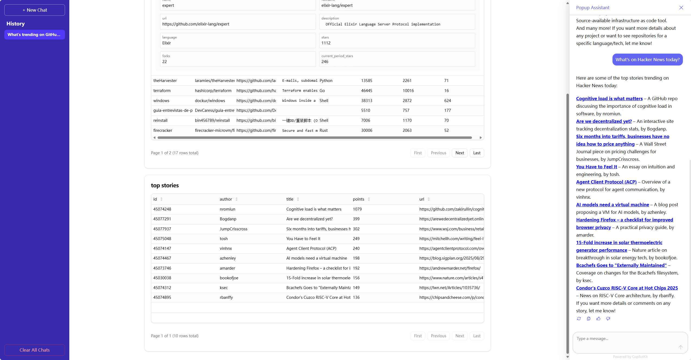
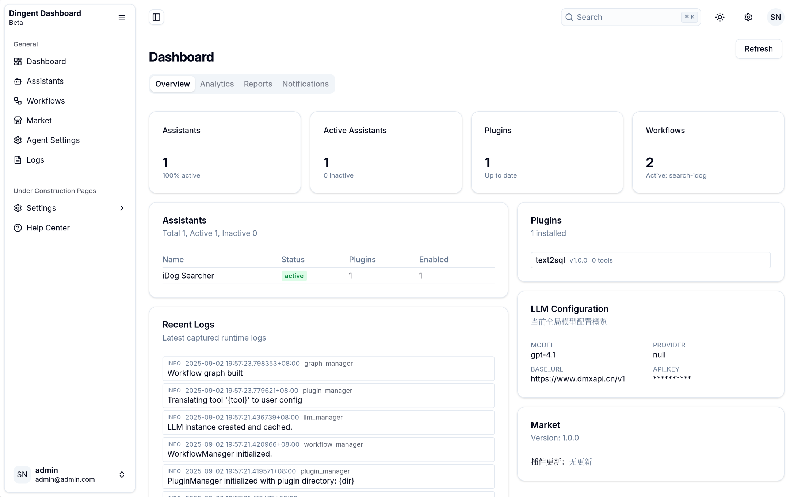
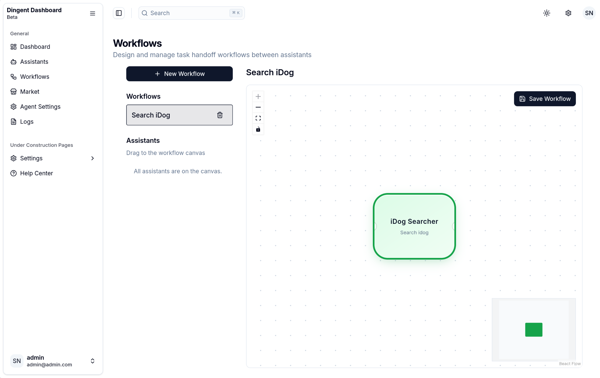
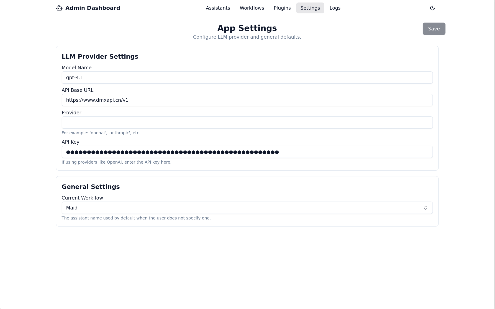
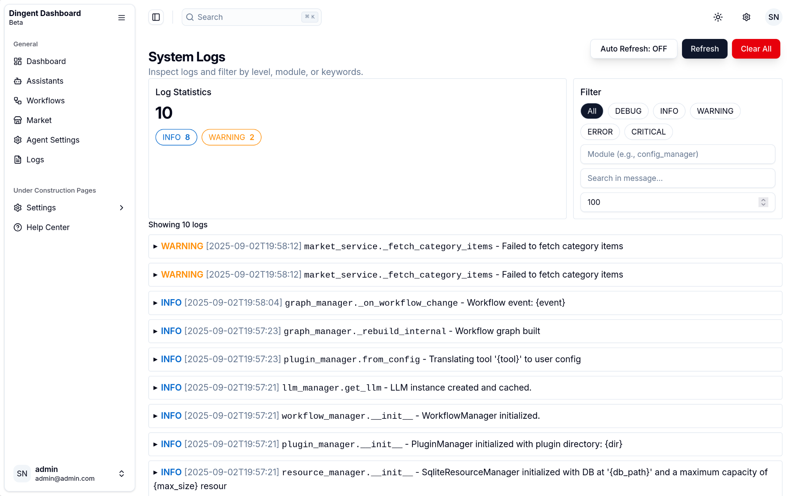
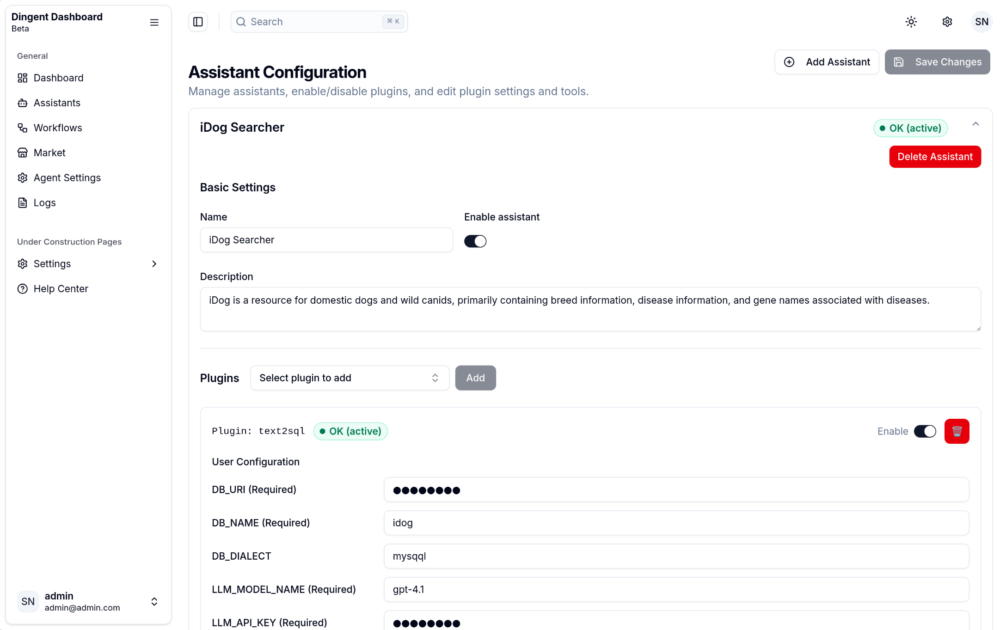
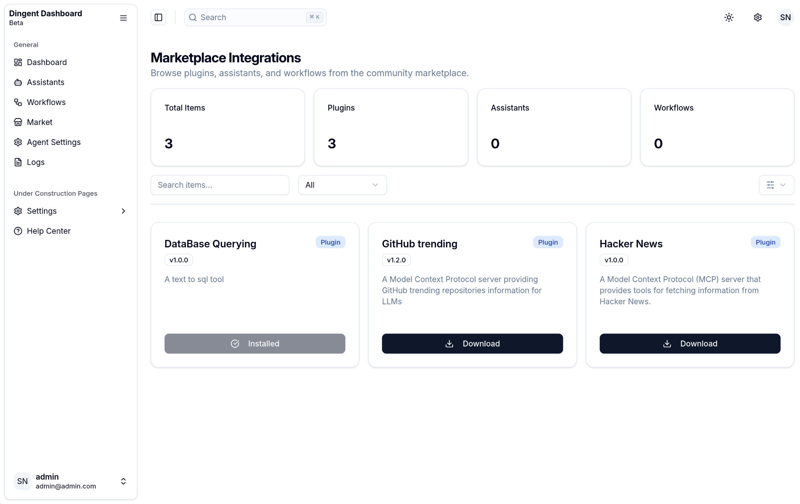

<div align="center"><a name="readme-top"></a>

# Dingent

  <strong>一个功能强大且用户友好的 LLM Agent 框架，旨在简化智能应用的整个开发生命周期。</strong>


[English](./README.md) · **简体中文**

[快速开始](https://saya-ashen.github.io/Dingent/docs/intro#fast-track)
|
[安装说明](https://saya-ashen.github.io/Dingent/docs/getting-started/installation)
|
[配置说明](https://saya-ashen.github.io/Dingent/docs/getting-started/configuration)


</div>


**Dingent** 是一个 Agent 框架，其核心目标是简化创建任何由大型语言模型（LLM）驱动的应用的过程。我们提供了一个简洁而强大的工具包...来构建能够自动化复杂工作流、与各种服务交互并执行智能分析的应用。对于任何自定义逻辑或集成，Dingent 提供了一个灵活的框架，开发者可以轻松地通过编写自定义代码进行扩展。

### 聊天界面

| Chat View 1 | Chat View 2 |
| :---: | :---: |
|  |  |

### 管理后台

| Dashboard - Overview | Dashboard - Workflows |
| :---: | :---: |
|  |  |
| **Dashboard - Settings** | **Dashboard - Logs** |
|  |  |
| **Dashboard - Assistants** | **Dashboard - Market** |
|  |  |

## 🎯 为什么选择 Dingent?

在构建 LLM 应用时，开发者通常需要花费大量时间编写“胶水代码”：创建后端服务、封装 API、设置前后端通信……这些任务既繁琐又重复。

**Dingent 的核心价值在于：**

  - **告别重复**: 我们将后端服务（LangGraph）、数据接口（**插件系统**）、聊天界面（CopilotKit）和**功能齐全的管理后台**的最佳实践打包成一个命令。您不再需要从零开始构建一切，可以立即开始编写核心业务逻辑。
  - **UI 配置**: 告别手动编辑复杂的配置文件。借助 Dingent 集成的管理后台，您可以通过直观的图形界面来管理助手、构建工作流和配置设置。
  - **可扩展且通用**: 虽然 Dingent 最初专注于数据检索，但它已发展成为一个强大的通用框架。其模块化架构和强大的插件系统允许您构建任何类型的 Agent——从简单的任务自动化机器人到复杂的多 Agent 系统。Dingent 提供坚实的基础，您带来无限的愿景。
  - **核心功能内置**: 我们认为一个简单易用的 Agent 不应该要求用户花费大量时间维护插件。因此，我们致力于将社区认为重要的功能直接集成到框架中。如果您认为某个功能至关重要，我们鼓励您开启一个 Issue 或 PR。这直接体现了我们“让 Agent 对用户更简单”的核心使命。
  - **平滑的学习曲线**: 您只需具备基本的 Python 知识即可构建强大的通用 Agent，而无需成为 LangGraph 或 FastAPI 的专家。同时，我们保留了扩展功能的灵活性，确保在需要时框架能完全支持自定义开发。

## ✨ 特性

  - **即时项目设置**: 只需在任何目录中运行 `dingent dev` 即可初始化一个新项目。
  - **集成管理后台**: 一个强大的、基于 React 的 Web 界面，用于可视化地管理您的助手、工作流、插件和设置。
  - **捆绑前端**: 开箱即用，包含一个预构建的、独立的 Next.js 聊天界面。无需手动设置或编译。
  - **轻量易用**: 简洁的设计和平缓的学习曲线让您专注于业务逻辑，而不是繁琐的配置。

## 🚀 快速开始

在几分钟内创建并运行一个功能齐全的 Agent 项目。

### 1\. 环境准备

在开始之前，请确保您的开发环境中已安装以下软件：

  - [**uv**](https://docs.astral.sh/uv/getting-started/installation/): 一个速度极快的 Python 包安装器和解析器。

<!-- end list -->

```bash
# 在 macOS 和 Linux 上
curl -LsSf https://astral.sh/uv/install.sh | sh

# 在 Windows 上
powershell -ExecutionPolicy ByPass -c "irm https://astral.sh/uv/install.ps1 | iex"
```

### 2\. 初始化并运行您的项目

导航到一个您想创建项目的空目录，并运行开发服务器。

```bash
mkdir my-awesome-agent
cd my-awesome-agent

# 运行开发服务器
uvx dingent dev # 或 uvx dingent run
```

首次运行此命令时，Dingent 会询问您是否要创建一个 `dingent.toml` 配置文件，从而正式将该目录转变为一个 Dingent 项目根目录。

`dev` 命令将启动所有必要的服务：

  - **前端聊天界面**: 可在 [http://localhost:3000](http://localhost:3000) 访问
  - **后端 API**: 运行在 [http://localhost:8000](http://localhost:8000)
  - **管理后台**: 可在 [http://localhost:8000/admin](http://localhost:8000/admin) 访问

您的项目现已上线！现在您可以：

  - **配置您的应用**: 打开管理后台 `http://localhost:8000/admin` 来创建助手、构建工作流并配置您的 LLM 设置。
  - **添加自定义工具**: 将您的自定义 MCP 服务器插件放入 `plugins/` 目录中。
  - **与您的 Agent 互动**: 通过前端 `http://localhost:3000` 开始与您的 Agent 聊天。

## 🏛️ 项目架构

一个 Dingent 项目拥有简单直观的结构，并由框架为您自动管理：

```plaintext
my-awesome-agent/
├── 📄 dingent.toml      # 主要项目配置（端口、模型等）。标记项目根目录。
├── 📁 config/           # 存储由后台管理的所有应用配置。
│   ├── 📁 assistants/
│   ├── 📁 plugins/
│   └── 📁 workflows/
└── 📁 plugins/          # 存放您的自定义工具插件（例如 MCP 服务器）的目录。
```

  - **`dingent.toml`**: 项目核心设置的唯一真实来源。该文件的存在告诉 Dingent 命令它们正处于一个项目目录中。
  - **`config/`**: 此目录存放您的助手、插件和工作流的配置。您通常不需要手动编辑这些文件，因为它们是通过**管理后台**进行管理的。
  - **`plugins/`**: 这是您添加自己功能的地方。将任何与 MCP 兼容的服务器放入此目录，Dingent 将自动发现并集成它。

## 🗺️ 路线图

  - **✅ 1. 文档与教程**

      - [x] **基础文档:** 安装和配置指南。
      - [x] **核心概念:** 对关键特性和设计的深入解释。
      - [ ] **插件开发指南:** 如何构建您自己的插件。
      - [ ] **端到端教程:** 完整的、分步骤的项目示例。

  - **⏳ 2. 管理后台**

      - [x] **核心 UI**: 功能齐全的仪表盘，用于管理助手、工作流和设置。
      - [x] **插件管理**: 直接从 UI 添加/删除插件。
      - [x] **高级工作流编辑器**: 更强大的工具，用于构建复杂的 Agent 行为。

  - **💡 3. 插件系统**

      - [x] **自动发现**: 自动从 `plugins/` 目录加载插件。
      - [ ] ~~**插件命令行工具:** 通过命令行安装和管理插件。~~
        (已被管理后台的 UI 管理功能取代)
      - [x] **插件市场:** 发现、搜索和下载社区插件。

  - **📦 4. 核心插件**

      - [x] **数据库插件:** 连接主流数据库。
      - [ ] **知识库问答插件:** 在您的文档上快速构建问答应用。

## 🤝 如何贡献

我们创建这个项目的初衷是让 Agent 对用户更简单，而不是构建又一个复杂的开发框架。因此，我们热烈欢迎并高度依赖社区的贡献来塑造 **Dingent** 的未来。

如果某个功能对您很重要，我们强烈鼓励您通过开启 GitHub Issue 来进行讨论，或者通过 Pull Request 直接贡献代码。我们的核心理念是，应该由开发者社区来决定哪些功能被内置于软件中，而不是让用户去维护自己的插件！

如果您认同我们的愿景并希望贡献代码，请遵循以下步骤：

1.  Fork 本仓库。
2.  创建一个新的功能分支 (`git checkout -b feature/YourAmazingFeature`)。
3.  提交您的更改 (`git commit -m 'Add some AmazingFeature'`)。
4.  将您的分支推送到 GitHub (`git push origin feature/YourAmazingFeature`)。
5.  创建一个 Pull Request，并清晰地描述您功能的价值。

我们相信，通过我们共同的努力，Dingent 可以成为一个真正强大且“开箱即用”的工具。

## 📄 许可证

本项目采用 [MIT 许可证](https://www.google.com/search?q=./LICENSE)。

## 📄 许可证

本项目采用 [MIT License](./LICENSE) 授权。
