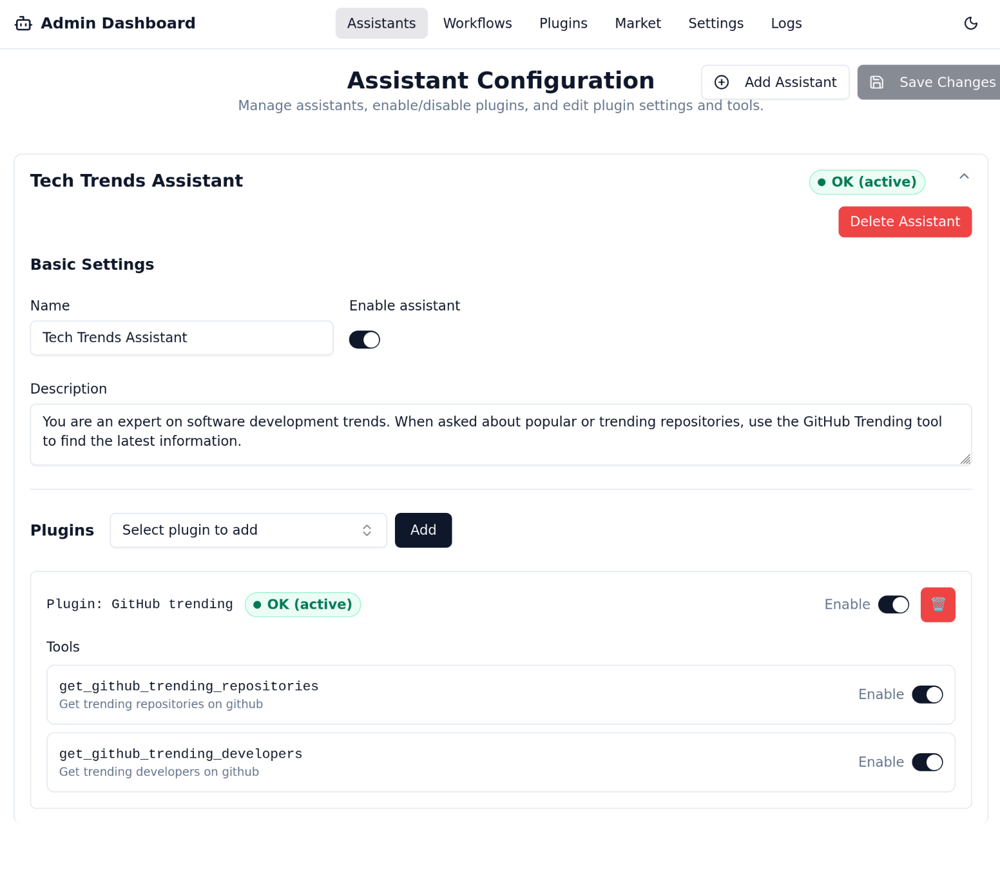

# Assistants Page

The Assistants page is where you create and define the "brains" of your operation. An assistant is an AI entity with a specific name, set of instructions, and a collection of tools (plugins) it can use to accomplish tasks.

## Creating a New Assistant

1.  Click the **"Add Assistant"** button.
2.  Fill in the configuration form:
    * **Name**: A short, descriptive name for your assistant (e.g., "Research Specialist").
    * **Instructions**: This is the core prompt that defines the assistant's personality, goals, and constraints. Be as specific as possible. For example: *"You are a helpful research assistant. When a user asks a question, use the Web Search plugin to find the most relevant and up-to-date information."*

3.  Click **Save**.

## Assigning Plugins (Tools)

After creating an assistant, you need to give it tools to work with.

1.  In the "Plugins" section for your assistant, you'll see a dropdown list of all plugins you have installed from the Market or created yourself.
2.  Select a plugin from the list and click **"Add"**.
3.  The plugin will now appear in the list of tools assigned to this assistant. The assistant will now know it can use this tool when its instructions call for it.

You can add multiple plugins to a single assistant to create powerful, multi-functional agents.

---

➡️ **Next: Let's activate our assistant using [The Workflows Page](./workflows-page.md)**
