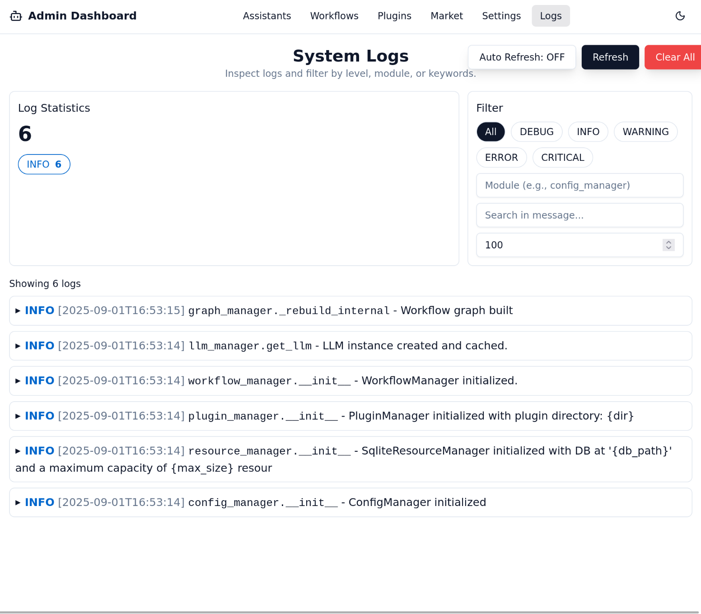

# Logs Page

The Logs page provides a real-time stream of events from the Dingent backend. It is an invaluable tool for debugging your agent's behavior, seeing which tools are being used, and understanding the LLM's reasoning process.

## Understanding the Logs

Each log entry typically includes:

* **Timestamp**: The exact time the event occurred.
* **Log Level**: The severity of the event (e.g., `INFO`, `DEBUG`, `ERROR`).
* **Message**: A description of the event.

You can see detailed information about:

* The start and end of a chat session.
* The exact input being sent to the LLM.
* The agent's decision to use a specific tool (plugin).
* The parameters the agent is passing to the tool.
* The output returned by the tool.

## How to Use the Logs

When your agent isn't behaving as expected, the Logs page should be your first destination.

For example, if your agent fails to use a tool you've assigned, you can check the logs to see if it even considered using it. You might find that your instructions (prompt) for the assistant need to be more specific to guide the agent's decision-making process correctly.
