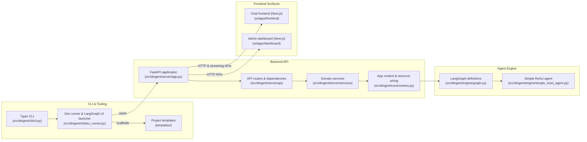

# Architecture

Dingent is composed of a lightweight Python backend, a LangGraph-based agent engine, and two prebuilt Next.js frontends that are orchestrated by the CLI. The diagram below highlights the primary building blocks and how data flows between them.

## Component summary

### CLI & project scaffolding
- `Typer` powers the developer-facing commands in [`src/dingent/cli/cli.py`], handling project initialization, environment checks, and multi-service orchestration.【F:src/dingent/cli/cli.py†L1-L146】【F:src/dingent/cli/cli.py†L147-L238】
- The dev runner coordinates LangGraph and FastAPI processes, as shown in [`src/dingent/cli/dev_runner.py`].【F:src/dingent/cli/dev_runner.py†L1-L44】
- Cookiecutter templates in [`templates/`] provide reproducible project scaffolds and plugin blueprints.【F:src/dingent/cli/cli.py†L147-L238】

### Backend API layer
- The FastAPI application is assembled in [`src/dingent/server/app.py`], wiring lifespan management, middleware, and router registration.【F:src/dingent/server/app.py†L1-L44】
- Application state is centralized through the `AppContext` defined in [`src/dingent/core/context.py`], which is initialized during startup and shared across services.【F:src/dingent/core/context.py†L1-L48】
- Feature-specific routers and service classes in [`src/dingent/server/api`] and [`src/dingent/server/services`] expose assistant, workflow, and plugin management capabilities to the frontends.【F:src/dingent/server/api/dependencies.py†L1-L80】【F:src/dingent/server/services/user_assistant_service.py†L1-L120】

### Agent execution engine
- LangGraph entrypoints live in [`src/dingent/engine/graph.py`], connecting the FastAPI layer with agent workflows.【F:src/dingent/engine/graph.py†L1-L120】
- Reusable agent behaviours, such as the bundled ReAct agent, are implemented in [`src/dingent/engine/simple_react_agent.py`].【F:src/dingent/engine/simple_react_agent.py†L1-L160】

### Frontend applications
- The chat experience is provided by the Next.js app under [`ui/apps/frontend`], which depends on shared UI and API packages via Turborepo workspaces.【F:ui/apps/frontend/package.json†L1-L44】
- The admin dashboard is another Next.js app in [`ui/apps/dashboard`], offering configuration tooling, workflow builders, and plugin management for end users.【F:ui/apps/dashboard/package.json†L1-L48】

Together, these layers deliver an opinionated agent platform: the CLI spins up aligned services, the FastAPI backend exposes agent and configuration APIs backed by LangGraph, and the paired Next.js frontends give users both chat and administrative surfaces.
