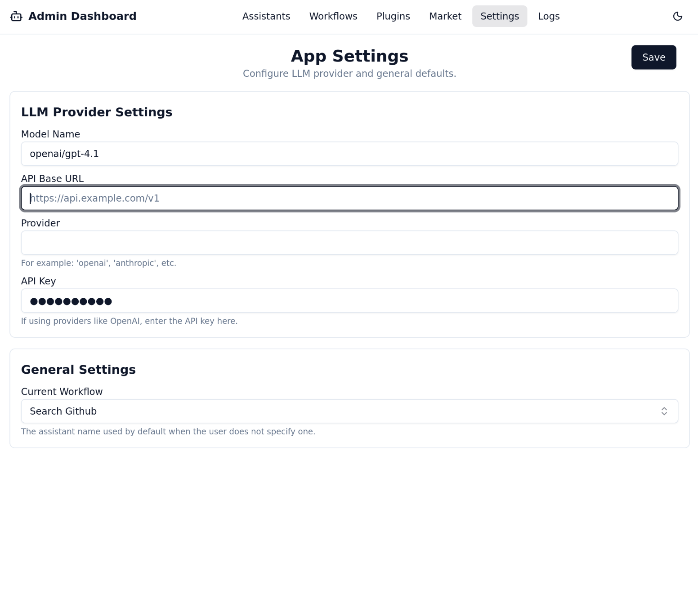
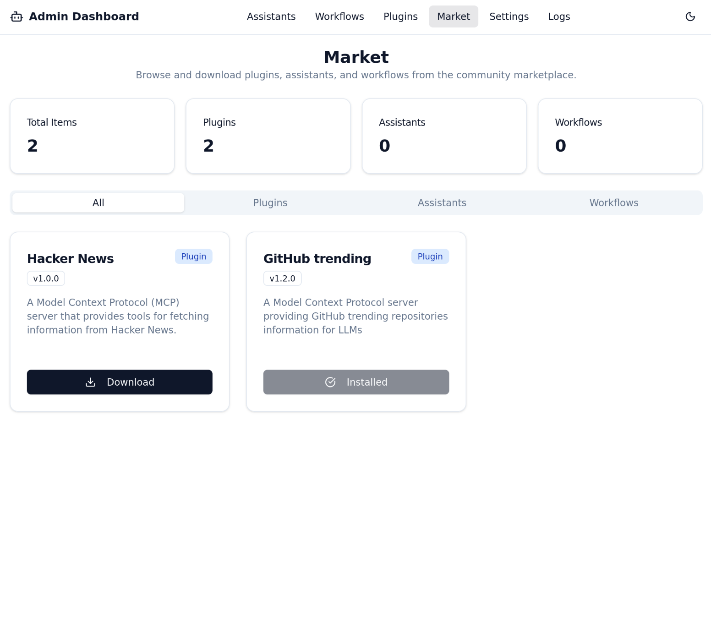
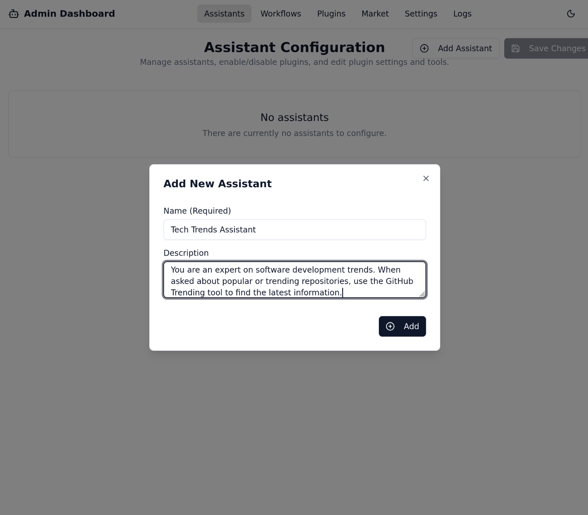
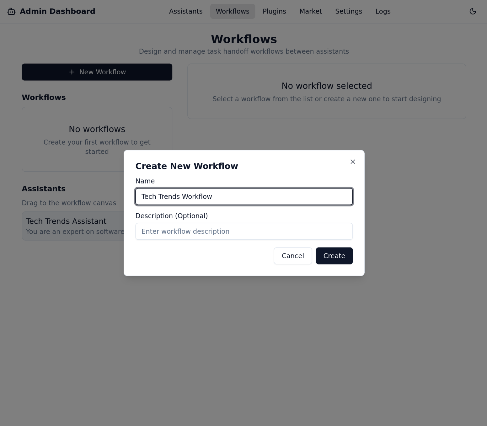
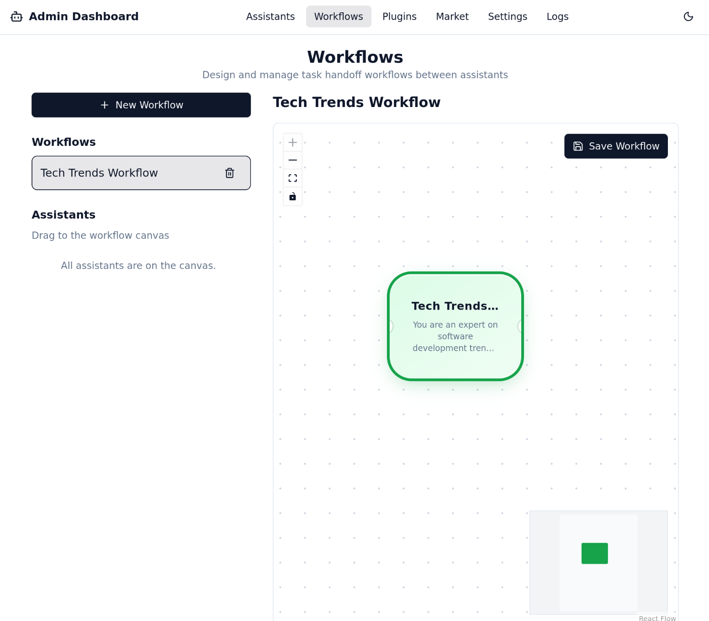
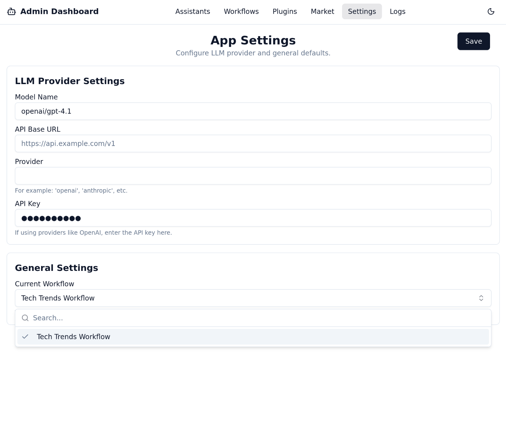

# Introduction

**Dingent** is an agent framework whose core goal is to simplify the process of creating any application powered by Large Language Models (LLMs). We provide a concise yet powerful toolkit to build applications capable of automating complex workflows, interacting with various services, and performing intelligent analysis. For any custom logic or integration, Dingent offers a flexible framework that developers can easily extend by writing custom code.

## Highlights

  - **No More Repetition**: We package the best practices for backend services (LangGraph), data interfaces (**Plugin System**), a chat interface (CopilotKit), and a **full-featured admin dashboard** into a single command. You no longer need to build everything from scratch and can start writing your core business logic immediately.

  - **Configuration via UI**: Forget manually editing complex configuration files. With Dingent's integrated admin dashboard, you can manage assistants, build workflows, and configure settings through an intuitive graphical interface.

  - **Extensible and Versatile**: While Dingent began with a focus on data retrieval, it has evolved into a powerful general-purpose framework. Its modular architecture and robust plugin system allow you to build any type of agent—from simple task automation bots to complex multi-agent systems. Dingent provides the solid foundation, you bring the vision.

  - **Core Features Built-In**: We believe a simple and easy-to-use agent shouldn't require users to spend a lot of time maintaining plugins. Therefore, we are committed to integrating features the community deems important directly into the framework. If you think a feature is crucial, we encourage you to open an Issue or PR. This directly reflects our core mission of "making Agents simpler for users."

  - **Smooth Learning Curve**: You only need a basic understanding of Python to build powerful, general-purpose agents, without needing to be an expert in LangGraph or FastAPI. At the same time, we retain the flexibility to expand functionalities, ensuring the framework can fully support custom development when needed.

## Fast Track

### Step 1: Initialize Your Project

Create and run a fully functional agent project in just a few minutes.

First, ensure you have [**uv**](https://docs.astral.sh/uv/getting-started/installation/) installed.

```bash
mkdir my-awesome-agent
cd my-awesome-agent

# Run the development server
uvx dingent dev
```

The first time you run this command, Dingent will initialize a new project in the current directory, creating a `dingent.toml` file and other necessary folders.

The `dev` command starts all necessary services:

  * **Frontend Chat**: [http://localhost:3000](http://localhost:3000)
  * **Backend API**: [http://localhost:8000](http://localhost:8000)
  * **Admin Dashboard**: [http://localhost:8000/admin](http://localhost:8000/admin)

Congratulations\! Your project is now live.

### Step 2: Configure Your LLM

Before you can chat, your agent needs to know which Large Language Model (LLM) to use.

1.  Open the **Admin Dashboard** in your browser at `http://localhost:8000/admin`.
2.  Navigate to the **Settings** page.
3.  Enter the details for your LLM provider, such as the model name and your API key.
4.  Click **Save**.



### Step 3: Install Your First Plugin from the Market

An empty Agent is like a craftsperson without tools. Let's install our first tool from the Market to give it a powerful new skill: **fetching live data from GitHub.**.

1.  In the **Admin Dashboard** (`http://localhost:8000/admin`), navigate to the **Market** page from the sidebar.
2.  Here, you will see a list of available plugins. Find the **GitHub trending** plugin.
3.  Click the **Download** button.



Excellent! The plugin is now downloaded to your project and is ready to be used by any assistant.

### Step 4: Create Your First Assistant

Now that we have a tool, we need to create an Assistant that knows how to use it.

1.  Navigate to the **Assistants** page and click "Add Assistant".
2.  Fill in the form:
      - **Name**: `Tech Trends Assistant`
      - **Instructions**: `You are an expert on software development trends. When asked about popular or trending repositories, use the GitHub Trending tool to find the latest information.`
      - Click **Save**.



3. **Add the GitHub Trending Plugin**: From the list of available plugins, select **GitHub Trending** and click "Add" to give this skill to your assistant.
      - Note: The first time you use a plugin, its dependencies will be installed automatically in the background. This may take a moment.


You have now defined an assistant with a specific skill!


### Step 5: Activate the Workflow

As before, we need to activate our new assistant through a workflow to make it accessible to the chat interface.

1.  Navigate to the **Workflows** page and create a new workflow.
2.  **Name**: `Tech Trends Workflow`

3.  From the assistant dropdown menu, select `Tech Trends Assistant`.

4.  Click **Save**.
5.  Finally, go to the **Settings** page, set the "Current Workflow" to `Tech Trends Workflow`, and save your settings.


### Step 6: Chat with Your New Smart Assistant

Everything is now in place\! Return to the **Frontend Chat** interface at `http://localhost:3000`.

This time, let's ask a question that a basic LLM might not be able to answer accurately, but your new assistant can:

**"What are the trending Python repositories on GitHub today?"**

You will now see the agent use the **GitHub Trending** tool to fetch live data directly from GitHub, providing you with the most current popular repositories. This perfectly demonstrates the power of the Dingent framework: easily composing tools through a UI to create applications far more capable than a standard chatbot.
