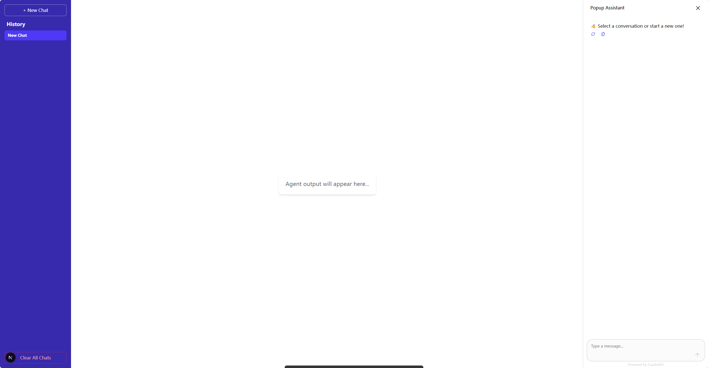
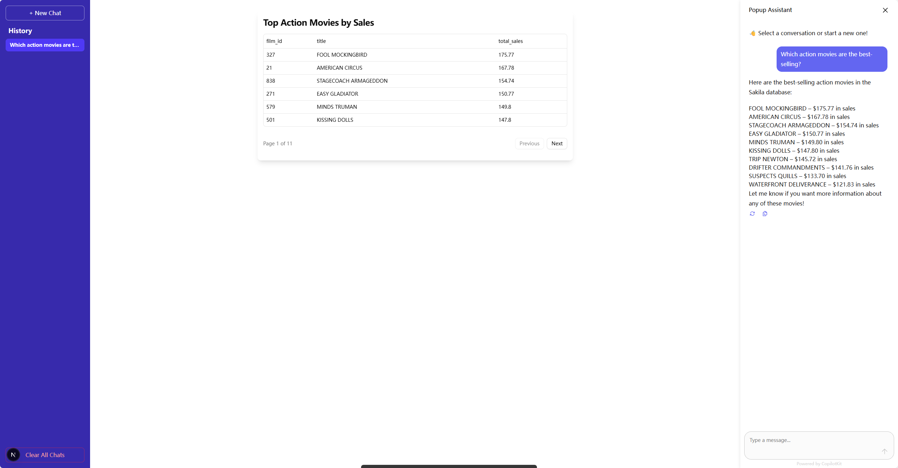

# Introduction

## Highlights
* **No More Repetition**: We package the best practices for backend services (LangGraph), data interfaces (Assistant), and frontend presentation (CopilotKit) into a single command. You no longer need to build everything from scratch and can start writing your core business logic immediately.

* **Core Features Built-In**: We believe a simple and easy-to-use agent shouldn't require users to spend a lot of time maintaining plugins. Therefore, we are committed to integrating features the community deems important directly into the framework. If you think a feature is crucial, we encourage you to open an Issue or PR. This directly reflects our core mission of "making Agents simpler for users."

* **Focused, Not Comprehensive**: Unlike other general-purpose Agent frameworks, Dingent specializes in data retrieval and Q\&A scenarios, offering a more lightweight and focused solution.

* **Smooth Learning Curve**: You only need a basic understanding of Python and some frontend knowledge to build powerful applications, without needing to be an expert in LangGraph or FastAPI. At the same time, we retain the flexibility to expand functionalities, ensuring the framework can fully support custom development when needed.

## Fast Track

### Step 1: Create a New Project
Create a fully functional agent project from scratch in just a few minutes.


Install [**uv**](https://docs.astral.sh/uv/getting-started/installation/) [**Node.js**](https://nodejs.org/en/download/) and [**bun**](https://bun.com/docs/installation) in your development environment, and create a new project use the template we provided.

```bash
# Use the 'basic' template to create a new project
uvx dingent init basic
```

Start the agent.
```bash
cd my-awesome-agent # Navigate to your project directory

# On macOS and Linux
export OPENAI_API_KEY=sk-xxxxxxxxxxxxxxxxxxx # Replace with your OpenAI API Key

# On Windows (PowerShell)
$env:OPENAI_API_KEY="sk-xxxxxxxxxxxxxxxxxxx" # Replace with your OpenAI API Key

uvx dingent run
```

Congratulations! You've successfully launched your first Agent project locally. Now, let's open up your browser, see what it looks like, and learn how to have your first conversation.


### Step 2: Start Your First Conversation


The Agent created with the `basic` template is a foundational conversational assistant. Its core identity and instructions are defined in the `assistants/config.toml` file at the root of your project. This file specifies the Agent's system prompt (its "personality") and the tools it can use.

Let's test it out. The `basic` template comes pre-configured with a `text2sql` tool connected to the sample "Sakila" database. Try asking a question that requires database access, for instance:

**"Which action movies are the best-selling?"**

Or, for a more advanced query:

**"Find all films starring PENELOPE GUINESS."**

Type your question into the input box and press Enter.

### Step 3: Observe the Agent's Response



You will see the Agent process your request and generate a response. This process is powered by the instructions in config.toml, which directs the Agent to use the Text2SQL tool to handle your query.

Notice the different parts of the screen:

- The main center panel shows the Agent's raw outputs, which normally are tables.

- The right-hand chat panel displays the final, user-friendly answer.

### Step 4: What's Next?

You've now successfully interacted with your first Agent. The real creation begins now!

- Supercharge Your Agent: Dive into the Configuration guide to learn how to add powerful tools to your Agent, such as live web search, database querying, or executing custom code.

- Build Your Own Tools: If you want to implement a feature not covered in the documentation, read the [Plugins Development guide](./advanced-guides/plugins-development.md) to create your very own custom plugins from scratch.

Your journey into Agent development is just beginning. Explore, create, and see what amazing applications you can build!
